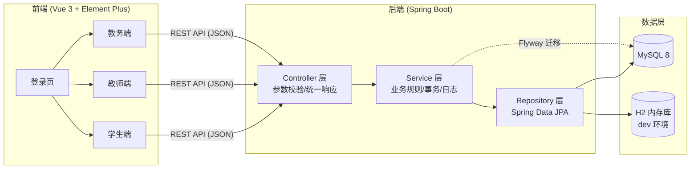
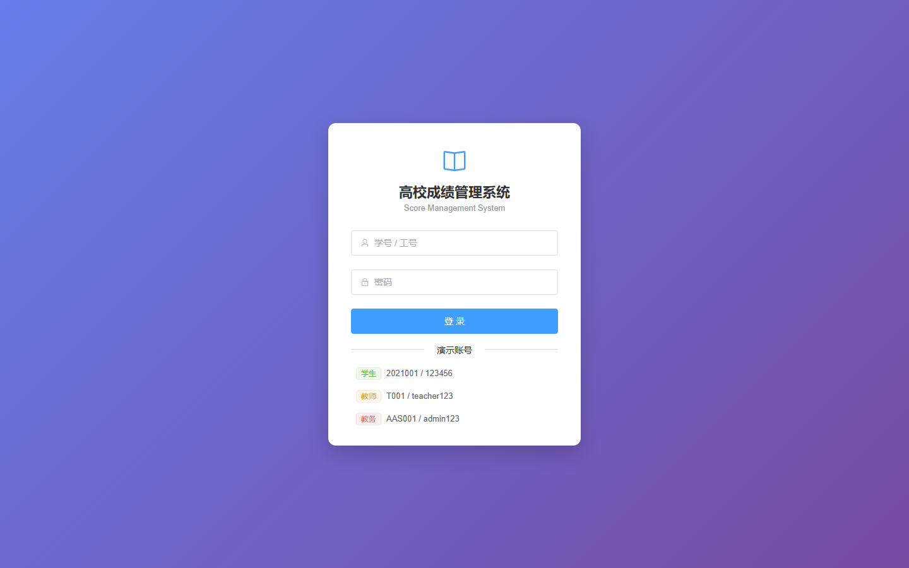
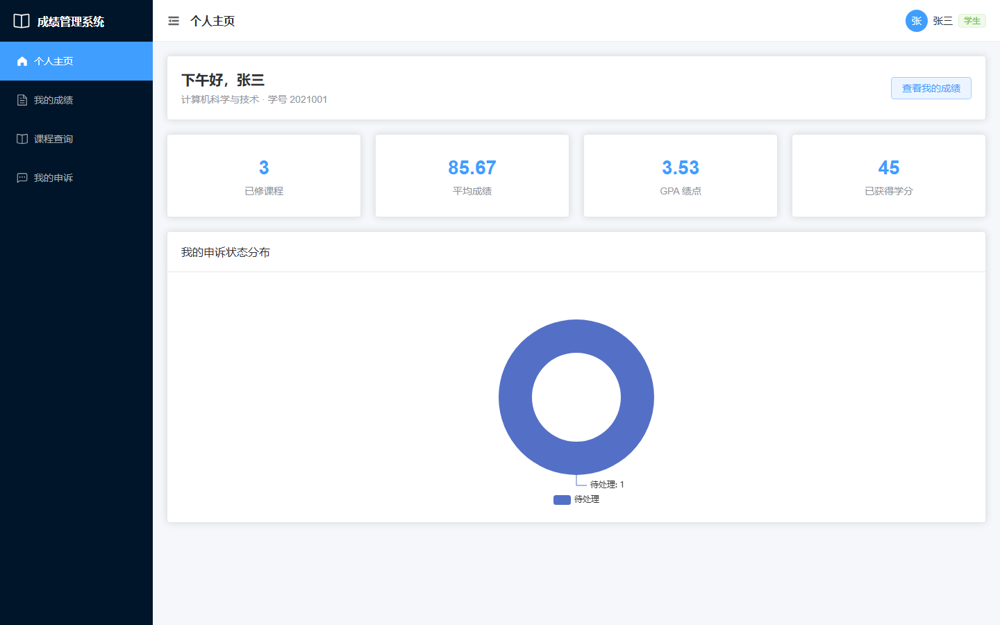
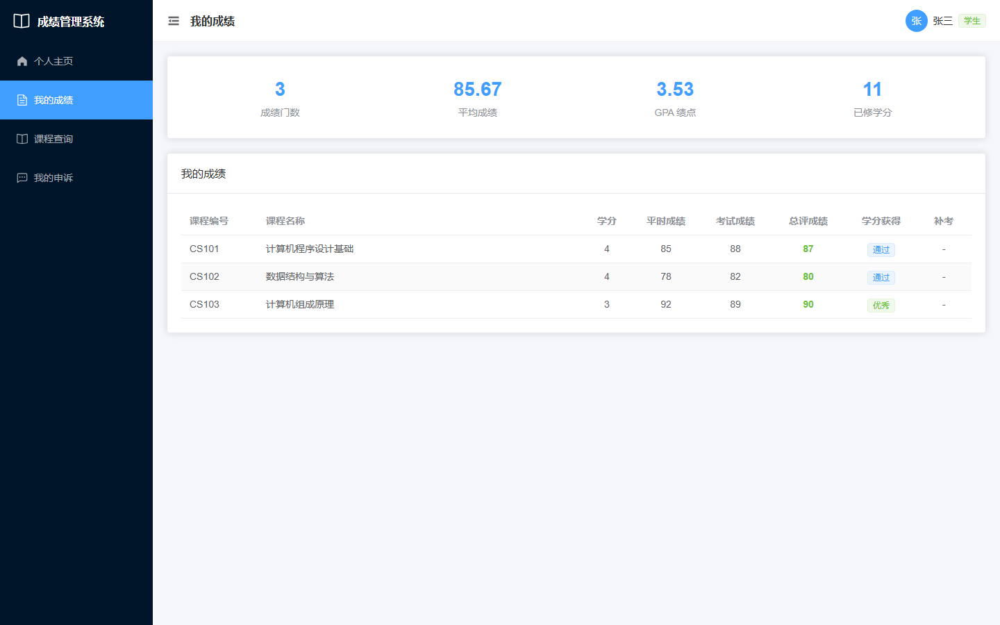
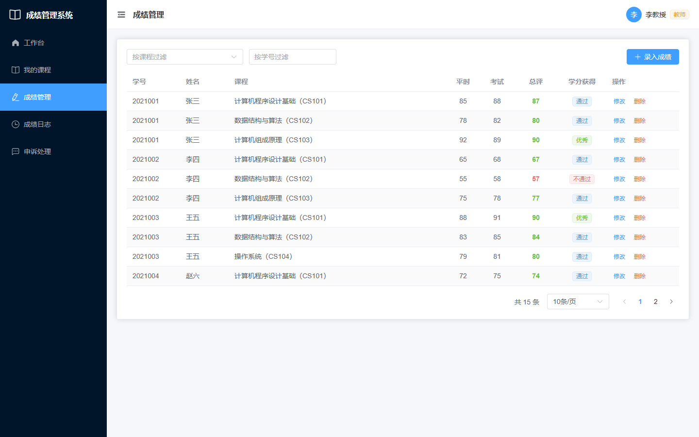
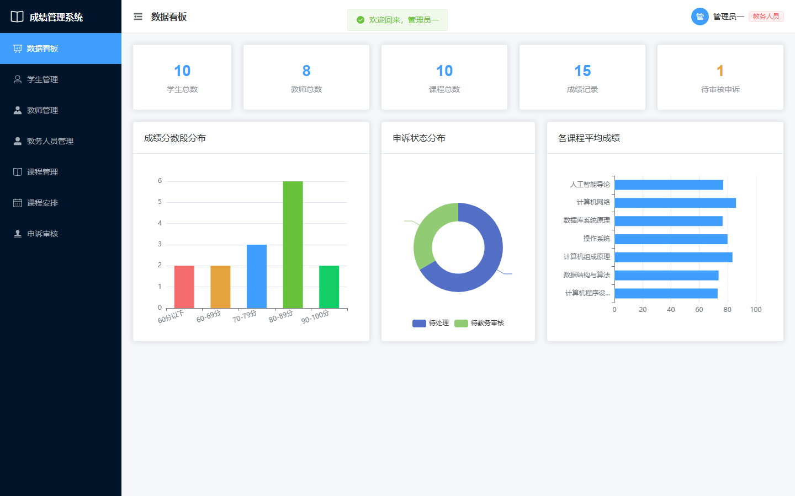
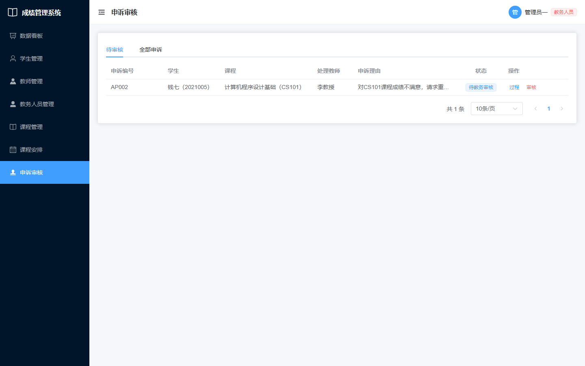

# 高校成绩管理系统（Score System）

[](https://github.com/lxz-cjt/Score_System/actions/workflows/ci.yml)
[](https://openjdk.org/)
[](https://spring.io/projects/spring-boot)
[](https://vuejs.org/)
[](LICENSE)

面向**教务人员、教师、学生**三类角色的成绩管理与查询平台，前后端分离架构，覆盖成绩录入与统计、GPA 计算、成绩申诉全流程审批、课程与排课管理等核心场景。

**项目特点：克隆即可一键运行（内置 H2 内存库与示例数据，无需安装数据库）**，并可通过 Docker Compose 一键切换 MySQL 8。

---

## 功能特性

| 角色 | 功能 |
|---|---|
| 🎓 学生 | 成绩与课程查询、平均分/GPA 自动计算、发起/取消成绩申诉、申诉处理进度时间线 |
| 👨‍🏫 教师 | 成绩录入/修改/删除（总评自动计算、操作留痕）、成绩变更日志、学生申诉处理、授课统计 |
| 🏛️ 教务 | 学生/教师/教务账号管理、课程与排课管理、申诉终审、全局数据看板（成绩分布/申诉状态/课程均分） |

## 技术栈

**后端**

| 技术 | 说明 |
|---|---|
| Spring Boot 3.5 + Java 21 | 主框架 |
| Spring Data JPA (Hibernate) | 持久层 |
| MySQL 8 / H2 | 生产数据库 / 本地零依赖运行与测试 |
| Flyway | 数据库版本化迁移（建表 + 示例数据） |
| Spring Validation | 请求参数校验 |
| springdoc-openapi | Swagger API 文档 |
| BCrypt | 密码加密存储 |
| JUnit 5 + Mockito + MockMvc | 单元测试与集成测试 |
| Maven / Lombok | 构建工具 / 样板代码消除 |

**前端**

| 技术 | 说明 |
|---|---|
| Vue 3 + Vite | 前端框架与构建 |
| Element Plus | UI 组件库 |
| Pinia + Vue Router | 状态管理 / 路由（角色路由守卫） |
| Axios | HTTP 封装（统一响应拆包、401 跳转登录） |
| ECharts | 数据看板图表 |

## 系统架构



### 核心业务设计

- **总评自动计算**：成绩录入/修改时由服务端统一计算总评（平时 30% + 考试 70%），自动得出学分获得条件（≥90 优秀 / ≥60 通过 / 其余不通过）与补考标记，避免各端口径不一致
- **成绩变更留痕**：成绩的增/改/删全部写入 `score_log`（操作人、操作前后数值、时间），可追溯
- **申诉状态机**：`待处理(PENDING) → 教师处理 → 待教务审核(SUBMITTED_TO_ADMIN) → 已通过/已拒绝`，学生可在教师处理前取消；全程处理记录写入 `appeal_process` 形成时间线，重复申诉与越权操作均被拦截
- **工程规范**：统一响应体/错误码、全局异常处理（消灭 Controller 层 try-catch 样板）、DTO/VO 分层（实体不直接暴露）、VO 批量组装避免 N+1 查询、列表接口统一分页
- **安全**：密码 BCrypt 加密存储与校验；数据库凭据等敏感配置全部环境变量注入，不入库

## 项目结构

```
Score_System/
├── .github/workflows/ci.yml     # GitHub Actions CI（后端测试 + 前端构建）
├── docker-compose.yml           # 一键启动 MySQL 8
├── pom.xml
├── src/
│   ├── main/java/io/github/lxzcjt/scoresystem/
│   │   ├── common/              # 统一响应 Result / 分页 PageResult / 错误码
│   │   │   └── exception/       # 业务异常 + 全局异常处理器
│   │   ├── config/              # CORS / OpenAPI / PasswordEncoder 配置
│   │   ├── controller/          # 接口层（10 个控制器）
│   │   ├── dto/                 # 请求 DTO（@Valid 校验）与响应 VO
│   │   ├── entity/              # JPA 实体（9 张表）
│   │   ├── enums/               # 申诉状态 / 用户角色
│   │   ├── repository/          # Spring Data JPA 仓库
│   │   └── service/             # 业务层（事务/日志/业务规则）
│   ├── main/resources/
│   │   ├── application.yml      # 公共配置（默认 dev 环境）
│   │   ├── application-dev.yml  # H2 内存库（一键运行）
│   │   ├── application-mysql.yml# MySQL（环境变量注入）
│   │   ├── application-prod.yml # 生产环境（关闭 Swagger，强制环境变量）
│   │   └── db/migration/        # Flyway 脚本（V1 建表 / V2 示例数据）
│   └── test/                    # 单元测试 + 集成测试（36 个用例）
├── frontend/                    # Vue 3 前端
│   └── src/
│       ├── api/                 # Axios 封装与各模块接口
│       ├── layout/              # 后台布局（角色动态菜单）
│       ├── router/              # 路由与角色守卫
│       ├── store/               # Pinia 登录状态
│       └── views/               # 16 个页面（登录 + 三角色）
└── docs/screenshots/            # 运行截图
```

## 快速开始

### 前置要求

- JDK 21+（后端）
- Node.js 20+（前端）
- Docker（可选，仅 MySQL 方式需要）

### 方式一：H2 内存库一键运行（推荐，零依赖）

```bash
# 1. 启动后端（自动建表 + 灌入示例数据）
./mvnw spring-boot:run

# 2. 启动前端（新开一个终端）
cd frontend
npm install
npm run dev
```

访问 **http://localhost:5173**，使用下方演示账号登录。

- Swagger API 文档：http://localhost:8080/swagger-ui.html
- H2 控制台：http://localhost:8080/h2-console（JDBC URL：`jdbc:h2:mem:score_system`，用户名 `sa`，密码留空）

### 方式二：MySQL 8（Docker Compose）

```bash
# 1. 启动 MySQL 8
docker compose up -d

# 2. 使用 mysql 环境启动后端
./mvnw spring-boot:run -Dspring-boot.run.profiles=mysql

# 3. 启动前端（同上）
```

> 数据库连接信息通过环境变量覆盖：`MYSQL_HOST` / `MYSQL_PORT` / `MYSQL_DATABASE` / `MYSQL_USERNAME` / `MYSQL_PASSWORD`

### 演示账号

| 角色 | 账号 | 密码 |
|---|---|---|
| 学生 | `2021001` | `123456` |
| 教师 | `T001` | `teacher123` |
| 教务 | `AAS001` | `admin123` |

> 数据库中存储的均为 BCrypt 加密后的密码哈希。

## 运行截图

| 登录页 | 学生端主页 |
|---|---|
|  |  |

| 学生成绩 | 教师成绩管理 |
|---|---|
|  |  |

| 教务数据看板 | 教务申诉审核 |
|---|---|
|  |  |

更多截图见 [docs/screenshots](docs/screenshots/)。

## API 概览

启动后访问 Swagger UI 查看完整文档与在线调试：http://localhost:8080/swagger-ui.html

| 模块 | 接口 |
|---|---|
| 认证 | `POST /api/auth/login` |
| 成绩 | `GET/POST /api/scores`、`PUT/DELETE /api/scores/{id}`、`GET /api/scores/student/{id}`、`GET /api/scores/student/{id}/summary`（GPA） |
| 成绩日志 | `GET /api/score-logs`（分页，可按成绩/操作人过滤） |
| 申诉 | `POST /api/appeals`、`PUT /api/appeals/{id}/cancel`、`PUT /api/appeals/{id}/process`（教师）、`PUT /api/appeals/{id}/review`（教务）、`GET /api/appeals/{id}/processes`（时间线） |
| 学生/教师/教务管理 | `GET/POST/PUT/DELETE /api/students`、`/api/teachers`、`/api/staff` |
| 课程/排课 | `GET/POST/PUT/DELETE /api/courses`、`/api/course-arrangings` |
| Dashboard | `GET /api/dashboard/student/{id}`、`/teacher/{id}`、`/admin/{staffId}` |

统一响应格式：

```json
{ "code": 200, "message": "操作成功", "data": { } }
```

## 测试

```bash
./mvnw verify
```

- **单元测试**（JUnit 5 + Mockito）：总评计算规则、GPA 学分加权、申诉状态机流转与越权拦截、BCrypt 登录认证
- **集成测试**（MockMvc + H2 + Flyway）：登录、参数校验、成绩录入与防重复、申诉全流程（提交→处理→审核）、分页、Dashboard 统计，共 36 个用例
- CI：每次 push 自动执行后端 `mvn verify` 与前端 `npm run build`，见 [Actions](https://github.com/lxz-cjt/Score_System/actions)

## Roadmap

- [ ] 登录升级为 JWT 无状态认证（当前为演示用简易令牌）
- [ ] 接口级权限拦截（当前权限控制在前端路由守卫）
- [ ] Redis 缓存 Dashboard 统计数据
- [ ] Dockerfile 与应用镜像打包部署
- [ ] 支持 Excel 批量导入成绩

## License

[Apache License 2.0](LICENSE)
